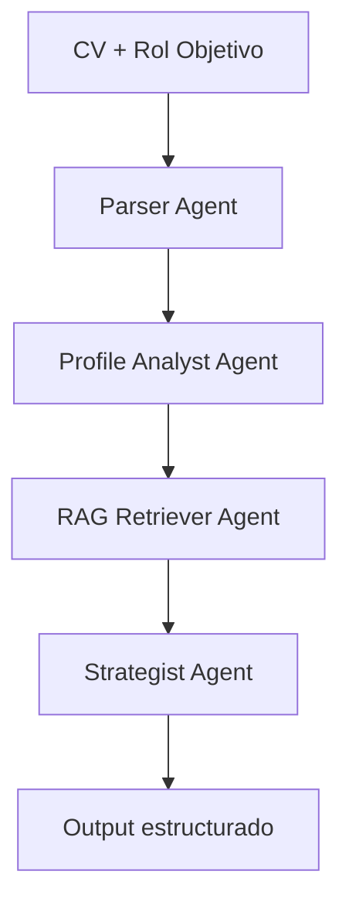

# ProfileLab

## Descripción

ProfileLab es una POC multi-agente que optimiza perfiles de LinkedIn a partir de un CV y un rol objetivo.

El sistema recibe:

- Un CV en formato PDF o DOCX
- Un rol objetivo definido por el usuario

Y genera:

- Headline optimizado
- Sección About
- Skills sugeridas
- Recomendaciones SEO
- Ideas de contenido

El objetivo es mejorar el posicionamiento del perfil para recruiters utilizando un flujo basado en IA, agentes especializados y conocimiento externo mediante RAG.

---

## Objetivo de la POC

Esta POC valida un flujo multi-agente end-to-end que:

- Descompone el problema en agentes especializados
- Coordina agentes mediante un grafo (LangGraph)
- Integra conocimiento externo (RAG)
- Genera salida estructurada y accionable
- Maneja fallos reales de LLM (rate limits, errores de formato)
- Expone trazabilidad completa mediante logs

---

## Arquitectura

Componentes principales:

- UI: Streamlit (entrypoint + visualización de resultados)
- Backend: Python
- Orquestación: LangGraph
- Agentes especializados
- RAG Retriever + Knowledge Base (Markdown en `data/`, vectores persistentes con Chroma)
- Abstracción de LLM (OpenAI / Groq)
- Validación estructurada con Pydantic
- Logging por etapa

---

## Elección del framework

Se eligió LangGraph por:

- Modelo basado en grafos → ideal para flujos multi-agente
- Manejo explícito de estado
- Control determinístico del pipeline
- Trazabilidad clara entre pasos
- Alta extensibilidad

Esto permite evitar flujos implícitos y tener control total sobre la orquestación.

---

## Agentes y responsabilidades

### Parser Agent

Tipo: determinístico

Responsabilidad:

- Leer el CV
- Extraer texto
- Normalizar contenido

Decisión:

- No usa LLM → reduce costo y aumenta confiabilidad

---

### Profile Analyst Agent

Tipo: LLM

Responsabilidad:

- Analizar perfil profesional
- Detectar seniority
- Identificar skills clave
- Interpretar experiencia
- Evaluar fit con rol objetivo

---

### RAG Retriever Agent

Tipo: recuperación

Responsabilidad:

- Buscar chunks relevantes (similitud coseno con Sentence Transformers)
- Inyectar buenas prácticas externas
- Reducir respuestas genéricas

Implementación:

- Módulo `app/rag/chroma_rag.py`: Chroma como base vectorial **local en disco** (`vector_store/chroma/`, ignorada por git)
- Misma lógica que antes (chunking + embeddings + top-k), con **persistencia**: los embeddings no se recalculan si el contenido del archivo no cambió (sync por hash SHA-256)
- Corpus: todos los archivos **`data/**/*.md`** (por ejemplo `data/linkedin_best_practices.md` y cualquier otro `.md` que agregues)

---

### Strategist Agent

Tipo: LLM

Responsabilidad:

- Generar output final
- Integrar análisis del perfil + contexto RAG
- Adaptar la salida al rol objetivo

Genera:

- Headline
- About
- Skills
- Recomendaciones SEO
- Ideas de contenido

---

## Flujo del sistema

1. Usuario carga CV  
2. Usuario define rol objetivo  
3. Parser Agent procesa el CV  
4. Profile Analyst interpreta el perfil  
5. RAG Retriever obtiene contexto externo  
6. Strategist genera salida final  
7. UI muestra resultados + logs  

---

## Input / Output

### Input

- CV (PDF o DOCX)
- Rol objetivo

### Output

- Headline optimizado
- About
- Skills sugeridas
- Recomendaciones SEO
- Ideas de contenido

---

## Diagrama de arquitectura



---

## Decisiones de diseño

- Separación por agentes → bajo acoplamiento  
- Orquestación explícita con LangGraph  
- Parser determinístico → eficiencia y confiabilidad  
- Uso de RAG → mejora calidad semántica  
- Output estructurado → consistencia  
- Abstracción de LLM → soporte multi-provider  
- Logging por etapa → observabilidad  
- Simplicidad primero → evitar sobreingeniería  

---

## Manejo de errores y resiliencia

El sistema contempla:

- Reintentos y fallback de **modelo** en Groq para salida estructurada (inestabilidad / rate limits / tool calling)  
- Selección manual del proveedor LLM en la UI (`groq` u `openai`); no hay failover automático entre APIs  
- Validación estructurada con Pydantic  
- Manejo de errores de parsing (incluye PDFs escaneados sin capa de texto)  
- Logging por nodo y trazas del LLM cuando aplica  

Beneficios:

- Mayor tasa de éxito  
- Evita fallos totales  
- Debugging simple  

---

## Tecnologías utilizadas

- Python  
- Streamlit  
- LangGraph  
- LangChain  
- OpenAI API  
- Groq API  
- Pydantic  
- Sentence Transformers (embeddings para RAG)  
- ChromaDB (vector store local persistente)  
- PyPDF / python-docx (extracción de CV)  

---

## Cómo ejecutar

git clone <repo-url>  
cd ProfileLab  

python -m venv venv  

# Windows  
venv\Scripts\activate  

# Linux / Mac  
source venv/bin/activate  

pip install -r requirements.txt  

Creá un archivo `.env` en la raíz del proyecto (el código usa `python-dotenv`). Solo necesitás la clave del proveedor que vayas a usar en la app:

```
GROQ_API_KEY=tu_clave_groq
OPENAI_API_KEY=tu_clave_openai
```

**UI (recomendado):**

```
streamlit run streamlit_app.py
```

**CLI de ejemplo:** también podés ejecutar `python main.py` (usa rutas y valores de demo definidos en ese archivo).

**RAG / Chroma:** la primera ejecución crea `vector_store/chroma/` e indexa los `.md` de `data/`. Si editás o agregás Markdown, en la próxima corrida solo se re-embeddean los archivos que cambiaron. Para forzar un reindex completo, borrá la carpeta `vector_store/`.

---

## Resultado

ProfileLab transforma un CV en una propuesta optimizada para LinkedIn combinando:

- Análisis semántico del perfil  
- Buenas prácticas externas (RAG)  
- Generación estructurada con LLMs  
- Flujo multi-agente observable  

El output es accionable y orientado a visibilidad frente a recruiters.

---

## Limitaciones

- La primera ejecución puede descargar el modelo de embeddings (Sentence Transformers)  
- Knowledge base basada en Markdown estático bajo `data/` (archivos `.md`)  
- Sin métricas automáticas  
- Dependencia del CV de entrada  
- Sin persistencia de resultados  
- Sin capa conversacional  

---

## Oportunidades de mejora

- Capa conversacional (chat iterativo)  
- Persistencia de resultados (outputs de la app)  
- Métricas de calidad  
- Feedback loop  
- Versionado de outputs  
- Optimización ATS  
- Nuevos agentes  

---

## Alineación con el challenge

- Uso de LangGraph  
- Múltiples agentes con roles claros  
- Integración de fuente externa (RAG)  
- Logging y trazabilidad  
- Arquitectura documentada  
- Flujo ejecutable end-to-end  

---

## Autor

ProfileLab — POC multi-agente para optimización profesional.

Diseñado y desarrollado por Leonel Gordón